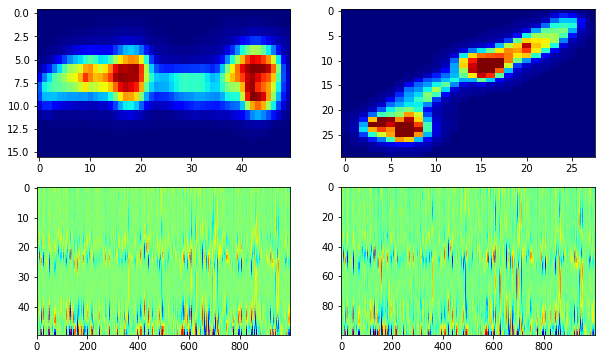
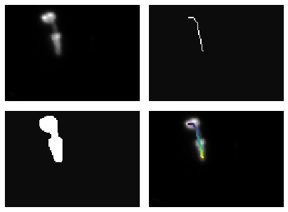
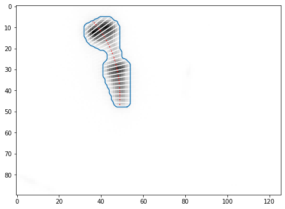
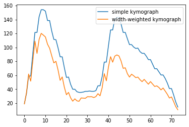

# PharaGlow

Package to track and analyze C. elegans pharynx from movies. Tracking is based on the package trackPy (http://soft-matter.github.io/trackpy/v0.4.2/). The package can be used to simply track labelled pharynxes or as a simple center of mass tracker for brightfield, but it also has a pipeline to extract pharyngeal pumping and features of the pharynx.

### Installation
5. Install pharaglow
python setup.py install --user

### Pharaglow parameter file
Pharaglow uses a json parameter file to expose parameters that are allowed to be changed to you.
These parameters are:
{"searchRange": 60,
"minimalDuration": 100,
"memory": 30,
"minSize":800,
"maxSize":1200,
"watershed": 100,
"widthStraight":5,
"pad":5,
"nPts":100
}
#### Parameters for detection
* minSize (px) - remove all objects smaller than this
* maxSize (px) - remove all objects larger than this (but a caveat here is when we have worm collisions where we allow the resulting segmentation to be a bit bigger)
* watershed (px) - when two or more worms touch, how large is an individual approximately

#### Parameters for tracking
* searchrange (px) describes how much we expect a worm to move frame-to-frame when we link particles together during tracking. This can be a bit bigger to allow for loosing the worm for a bit.
* memory (frames) - when we loose a worm for a few frames, how long can gaps be until we call it a 'new' worm
* minimalDuration (frames)- filters out worm trajectories that are shorter than this. 

#### Parameters for pharynx feature extraction
 * widthStraight - how wide is a worm for the straightened image
 * pad - crops a boundary around a worm for image analysis. this helps when the mask is a bit too small.
 * nPts - how many points along the centerline are we measuring. This should relate to the typical length of a worm

### Running pharaglow on labelled pharynx movies
#### Tracking worms with PharaGlow
This code generates a pandas dataframe that contains the particles that were tracked.

```python
%matplotlib inline
import numpy as np
import pandas as pd
import pims
# image io and analysis
import json
from skimage.measure import label
# plotting
import matplotlib  as mpl 
import matplotlib.pyplot as plt 

#our packages
from pharaglow import tracking, run, features

# io
fname = "pathToData/NZ_0007_croppedsample.tif"
parameterfile = "PathToFile/pharaglow_parameters.txt"
print('Starting pharaglow analysis...')
rawframes = pims.open(fname)
print('Analyzing', rawframes)
print('Loading parameters from {}'.format(parameterfile))
with open(parameterfile) as f:
    param = json.load(f)
# detecting objects
print('Binarizing images')
masks = tracking.calculateMask(rawframes, minSize = param['minSize'])
print('Detecting features')
features = tracking.runfeatureDetection(rawframes, masks)
print('Done')
```


#### Running pharaglow on tracked dataframes.
```python
print('Linking trajectories')
trajectories = tracking.linkParticles(features, param['searchRange'], param['minimalDuration'])
print('Extracting pharynx data')
trajectories = run.runPharaglowOnStack(trajectories, param)
print('Done tracking. Successfully tracked {} frames with {} trajectories.'.format(len(rawframes), trajectories['particle'].nunique()))
```
An example kymograph after running both tracking and pharynx analysis


### Example running pharaGlow only
This would be useful when working with single-worm cropped data where tracking isn't neccessary.

```python
import matplotlib.pylab as plt
import numpy as np
from skimage.io import imread

import pharaglow.features as pg
```


```python
# load data
fname = '/media/scholz_la/hd2/Data/PumpTest/mCherry3-1_pumping.tif'
data = imread(fname, as_gray=False, plugin=None)
data = data[:, 60:150, 90:]
```


```python
# preprocessing image
im = data[150]
mask = pg.thresholdPharynx(im)
skel = pg.skeletonPharynx(mask)
order = pg.sortSkeleton(skel)
ptsX, ptsY = np.where(skel)
ptsX, ptsY = ptsX[order], ptsY[order]
```


```python
plt.figure(figsize=(8, 4))
plt.subplot(221)
plt.imshow(im, cmap=plt.cm.gray, interpolation='nearest')
plt.axis('off')
plt.subplot(222)
plt.imshow(skel,  cmap='gray', interpolation='nearest', alpha=0.95)
plt.axis('off')
plt.subplot(223)
plt.imshow(mask, cmap='gray', interpolation='nearest', alpha=0.95)
plt.axis('off')
plt.subplot(224)
plt.imshow(im, cmap='gray')
plt.scatter(ptsY, ptsX, c=order, s = 5);
plt.axis('off')
plt.subplots_adjust(hspace=0.1, wspace=-0.45, top=1, bottom=0, left=0, right=1)
plt.show()
```





```python
# getting centerline and width
poptX, poptY = pg.fitSkeleton(ptsX, ptsY)
contour = pg.morphologicalPharynxContour(mask, scale = 4, smoothing=2)
xstart, xend = pg.cropcenterline(poptX, poptY, contour, nP = len(ptsX))
xs = np.linspace(xstart, xend, 25)
cl = pg.centerline(poptX, poptY, xs)
dCl = pg.normalVecCl(poptX, poptY, xs)
widths = pg.widthPharynx(cl, contour, dCl)
lw = 10
wL =  np.stack([cl+lw*dCl, cl-lw*dCl], axis=1)
```


```python
plt.figure(figsize=(8, 8))
plt.imshow(255-im, cmap = 'gray')
plt.plot(cl[:,1], cl[:,0], 'r:')
plt.plot(contour[:,1], contour[:,0], zorder=10)
[plt.plot(wL[i,:,1], wL[i,:,0], 'w', alpha =0.5) for i in range(len(xs)-1)];

[plt.plot(widths[i, :,1], widths[i, :,0], 'w') for i in range(len(cl))];
```





```python
kymo = pg.intensityAlongCenterline(im, cl, linewidth =2)
kymoWeighted = pg.intensityAlongCenterline(im, cl, width = pg.scalarWidth(widths))

```


```python
# show different linescans - this helps to identify front and back of pharynx
plt.plot(kymo, label='simple kymograph')
plt.plot(kymoWeighted, label='width-weighted kymograph')
plt.legend();
```





```python
#local derivative, can enhance contrast
grad = pg.gradientPharynx(im)
# straightened image
straightIm = pg.straightenPharynx(im, xstart, xend, poptX, poptY, width=np.max(pg.scalarWidth(widths))//2)
```


```python
plt.subplot(121)
plt.imshow(grad, cmap = plt.cm.nipy_spectral)
plt.subplot(122)
plt.imshow(straightIm.T)
```


    <matplotlib.image.AxesImage at 0x7f19f1d232e8>


```python
# local gradient enhances anatomical features
kymo = pg.intensityAlongCenterline(grad, cl, linewidth =5)
kymoWeighted = pg.intensityAlongCenterline(grad, cl, width = pg.scalarWidth(widths))

```


```python
# show different linescans - this helps to identify front and back of pharynx
# notice rge drop for the grinder!
plt.plot(kymo, label='simple kymograph')
plt.plot(kymoWeighted, label='width-weighted kymograph')
plt.legend();
```


```python

```

